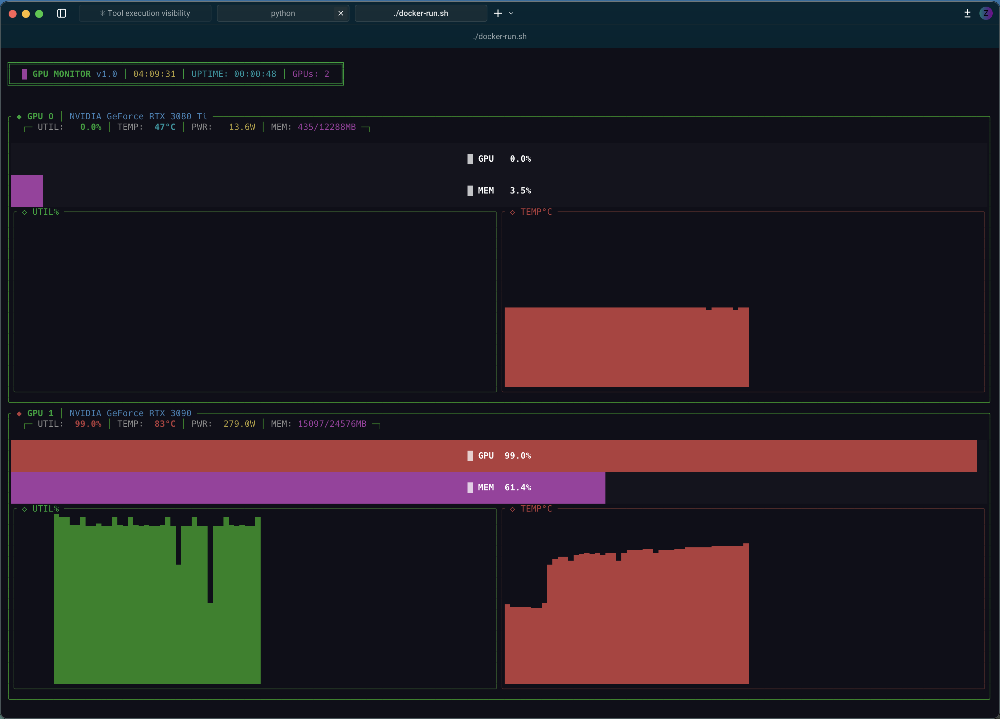

# GPU Graph CLI

Консольная утилита на Rust для мониторинга утилизации видеокарт NVIDIA через nvidia-smi с отображением графиков в реальном времени.

## Возможности

- Мониторинг нескольких видеокарт одновременно
- Отображение в реальном времени утилизации GPU, использования памяти, температуры и энергопотребления
- Визуальная тема в стиле киберпанк/хакер с неоновыми цветами
- Данные хранятся только в памяти (без сохранения на диск)
- Обновление данных каждую секунду
- Хранение истории метрик за последние 60 минут

## Требования

- Rust (версия 1.75 или выше)
- NVIDIA драйверы с nvidia-smi
- Linux (для работы с nvidia-smi)

## Зависимости

| Crate | Версия | Описание |
|-------|--------|----------|
| ratatui | 0.29.0 | Фреймворк для терминального UI |
| crossterm | 0.29.0 | Кроссплатформенная работа с терминалом |
| tokio | 1.48.0 | Асинхронный runtime |
| chrono | 0.4.42 | Библиотека для работы с датой и временем |

## Структура проекта

```
src/
├── main.rs      # Точка входа, настройка/очистка терминала, главный цикл
├── app.rs       # App struct - управление состоянием приложения
├── models.rs    # GpuDataPoint, GpuInfo - модели данных
├── nvidia.rs    # fetch_gpu_data - интеграция с nvidia-smi
├── theme.rs     # Цветовые константы (NEON_GREEN, DARK_BG и т.д.)
└── ui.rs        # Функции рендеринга UI
```

### Архитектура

- **`models.rs`** — Структуры данных (Data Layer)
- **`nvidia.rs`** — Интеграция с внешней системой (Infrastructure Layer)
- **`theme.rs`** — Конфигурация стилей (Presentation Constants)
- **`ui.rs`** — Рендеринг интерфейса (Presentation Layer)
- **`app.rs`** — Бизнес-логика приложения (Application Layer)
- **`main.rs`** — Инициализация и главный цикл (Entry Point)

## Сборка

```bash
cargo build --release
```

## Запуск

```bash
cargo run --release
```

Или после сборки:

```bash
./target/release/gpu-graph-cli
```

## Управление

- `q` или `Esc` - выход из программы

## Docker

### Сборка образа

```bash
docker build -t gpu-graph-cli .
```

### Запуск контейнера

```bash
docker run --gpus all -it --rm gpu-graph-cli
```

Или используйте вспомогательный скрипт:

```bash
./docker-run.sh
```

**Важно**: Для работы с GPU в Docker необходим nvidia-container-runtime. Убедитесь, что он установлен на вашей системе.

## Отображаемые метрики

Для каждой видеокарты отображаются:
- **GPU Utilization** - процент использования GPU (прогресс-бар + спарклайн график)
- **Memory Usage** - использование памяти (прогресс-бар)
- **Temperature** - температура GPU в °C (спарклайн график)
- **Power Usage** - энергопотребление в Ваттах

## Скриншот



Интерфейс выполнен в киберпанк эстетике:
- Цветовая схема с неоновыми зелёным, голубым, пурпурным и жёлтым цветами
- Спарклайн графики в реальном времени
- Индикаторы статуса, меняющие цвет в зависимости от уровня нагрузки

## Лицензия

MIT
